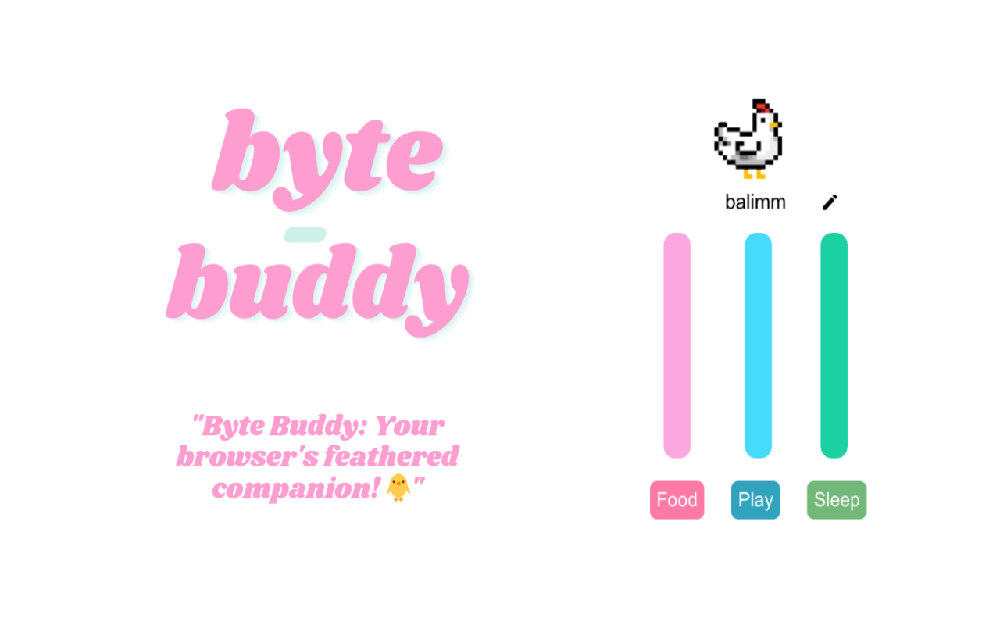

# Byte Buddy
<p align="center">
  
</p>


Your browser's feathered companion. You can interact with it by sleeping, feeding, and playing with it. It's a chicken for now, but more cuties are coming soon!

[Add to your browser NOW](https://chromewebstore.google.com/detail/byte-buddy/pbccnhlpehadbpnadlginigmfifejmcb)

## Motivation

I wanted to learn how to make an browser extension. I also wanted to make a cute little game that I could play with in my browser. So I decided to make it

I've used following technologies:

- JavaScript
- React
- Vite 
- LocalStorage
- React Icons

## Features

- (soon!)


## Development

You can run the app with the following commands:
```bash
// clone the repo
pnpm install
pnpm dev
```

## License

MIT